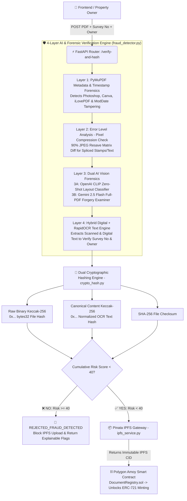

# 🏛️ TokenEstate — AI Document Forensics, OCR & Blockchain Verification Engine

> **Module 3: Decentralized Property Document Verification, Multi-Layer AI Anti-Fraud & IPFS Anchoring**  
> Powered by **FastAPI**, **OpenAI CLIP (Zero-Shot Vision)**, **RapidOCR (ONNX)**, **Gemini 2.5 Flash Multimodal**, **Error Level Analysis (ELA)**, **Pinata IPFS**, and **Polygon (`Keccak-256`)**.

---

## 📌 Project Overview & Why This Architecture Exists

In decentralized real estate platforms (**TokenEstate**), storing raw property deeds directly on Polygon is prohibitively expensive, while blindly hashing user-uploaded PDFs onto IPFS creates a **"Garbage In, Garbage Out" (GIGO)** vulnerability. Without off-chain forensics, a malicious actor could upload a Photoshopped title deed, a Canva-edited tax receipt, or an unrelated PDF and mint a fraudulent ERC-721 property token.

Furthermore, traditional single-hash verification systems fail to distinguish between **file container changes** (re-saving a PDF, which changes binary metadata) and **actual content tampering** (altering a price, survey number, or owner name).

### Key Innovations in Our v2 Architecture
1. **4-Layer Hybrid Forensic & AI Gatekeeper:** Combines low-level PDF header forensics, pixel-level Error Level Analysis (ELA), Zero-Shot Vision-Language classification (`openai/clip-vit-base-patch32`), optional multimodal document inspection (`gemini-2.5-flash`), and neural OCR (`RapidOCR`).
2. **Dual Cryptographic Hashing (`keccak256_hash` + `content_keccak256_hash`):**
   * **Raw Binary Keccak-256 Hash:** Hashes the exact binary stream of the file (`bytes32`) to guarantee 100% byte-for-byte immutability on Polygon.
   * **Canonical Content Keccak-256 Hash:** Normalizes all extracted digital + OCR text (stripping whitespace, punctuation, and PDF metadata) before hashing. This ensures that if the same legal deed is re-exported or scanned twice, our system still recognizes the underlying legal content as identical and prevents duplicate property registration.

---

## 🏗️ System Architecture & Pipeline Diagram



---

## 🤝 4-Member Blockchain Module Integration

| Member | Main Module | Blockchain & Backend Responsibilities |
| :--- | :--- | :--- |
| **Member 1** | **Property Registration** | Registers on-chain property state (`propertyId`, `surveyNumber`, `ownerAddress`) on Polygon and passes metadata to Module 3. |
| **Member 2** | **Tokenization & Transfer** | Manages ERC-721 NFT minting and smart-contract escrow. Queries Module 3 (`areAllDocumentsVerified`) before unlocking NFT minting. |
| **Member 3** | **Document Verification (This Module)** | Runs the 4-layer AI fraud detector, RapidOCR text extraction, Dual Keccak-256 hashing, IPFS pinning, and on-chain document verification. |
| **Member 4** | **Audit & Ownership History** | Indexes `DocumentUploaded` and `DocumentVerified` events emitted by Module 3 to construct the immutable ownership timeline. |

---

## 🧠 Detailed Breakdown: How Each Layer Works

Every document upload starts with `risk_score = 0` (Scale: `0` to `100`). Any forensic failure adds penalty points. If **`risk_score >= 40`**, the document is rejected (`FRAUD_DETECTED`) and blocked from IPFS.

### 1️⃣ Layer 1: PDF Metadata & Software Signature Forensics (`+45` to `+60` Risk)
* **Technology:** `pymupdf` document header inspection.
* **Mechanism:** Inspects internal PDF XMP/dictionary tags (`Producer`, `Creator`, `CreationDate`, `ModDate`).
* **What it catches:**
  * Flags PDFs generated or modified by consumer editing suites (`photoshop`, `canva`, `ilovepdf`, `sejda`, `gimp`, `illustrator`, `foxit`, `smallpdf`) -> **`+45 Risk`**.
  * Flags timestamp anomalies where `modDate != creationDate` -> **`+15 Risk`**.

### 2️⃣ Layer 2: Error Level Analysis / ELA Pixel Splicing Detection (`+40` Risk)
* **Technology:** `Pillow (PIL)`, `ImageChops`, and `NumPy`.
* **Mechanism:** Renders Page 1 of the PDF at `150 DPI`, re-compresses it in memory as a `90%` quality JPEG, and calculates the absolute pixel difference matrix (`|Original - Recompressed|`).
* **What it catches:** Authentic scanned documents degrade uniformly under JPEG compression. If a signature, stamp, or price digit is digitally pasted onto a scan, its compression error spikes above the background. If high-error pixels (`diff > 35`) exceed `1.5%` (`0.015`) of the page, it triggers **`+40 Risk`**.

### 3️⃣ Layer 3: AI Vision & Multimodal Forgery Detection (`+45` to `+95` Risk)
* **Layer 3A — Local Zero-Shot CLIP Vision (`openai/clip-vit-base-patch32`):**
  * Unlike legacy classifiers fixed to 1990s office categories, OpenAI's CLIP Vision-Language model evaluates the visual geometry of the document against custom real-estate prompts:
    * *"legal text document, official property deed, contract, or certificate"*
    * *"financial invoice, tax receipt, or government form"*
    * *"land survey map, blueprint, or floor plan"*
    * *"unrelated personal photo, selfie, meme, or advertisement"*
    * *"handwritten scribble or blank page"*
  * Runs 100% locally on CPU without requiring an external API key -> **`+45 Risk` if invalid visual category**.
* **Layer 3B — Deep Multimodal PDF Forensics (`gemini-2.5-flash` Free Tier API):**
  * When `GEMINI_API_KEY` is configured in `.env`, the raw PDF bytes are sent to Gemini 2.5 Flash to inspect visual stamp authenticity, contradictory legal clauses, and font-alignment tampering -> **`+45` to `+50 Risk`**.

### 4️⃣ Layer 4: Hybrid Digital + RapidOCR Text Cross-Verification (`+25` to `+60` Risk)
* **Technology:** `pymupdf` text stream + `rapidocr-onnxruntime` (PaddleOCR ONNX neural engine).
* **Mechanism:** Extracts embedded digital text and runs neural OCR on the rendered page image so **both digital PDFs and scanned stamp-paper deeds** are accurately read.
* **What it catches:** Cross-checks whether the `survey_number` (**`+35 Risk`** if missing) and `owner_name` (**`+25 Risk`** if missing) submitted by the user actually exist inside the document.

---

## 🔐 Dual Cryptographic Hashing Logic (`crypto_hash.py`)

| Hash Field | Algorithm | Input Data | Purpose in TokenEstate |
| :--- | :--- | :--- | :--- |
| `keccak256_hash` | EVM `Keccak-256` (`0x...` 32 bytes) | Raw PDF binary bytes (`file_bytes`) | Passed directly to Solidity `bytes32 docHash`. Changes if even 1 bit of the file or metadata is altered. |
| `content_keccak256_hash` | EVM `Keccak-256` (`0x...` 32 bytes) | Lowercase, alphanumeric-only extracted OCR + digital text | **Anti-Duplicate & Content Fingerprint:** Stays 100% identical even if a PDF is re-saved or has different metadata, proving whether the legal text itself was changed. |
| `sha256_hash` | Standard `SHA-256` | Raw PDF binary bytes (`file_bytes`) | Standard Web2/IPFS off-chain file checksum. |

---

## 📂 Backend Project Structure

```text
backend/
├── main.py                              # FastAPI application entry point & CORS config
├── generate_test_pdfs.py                # Automated test-suite generator (creates 4 test PDFs)
├── pyproject.toml                       # Python project dependencies (uv)
├── uv.lock                              # Deterministic lockfile
├── .env.example                         # Environment variable template
├── .gitignore                           # Git ignore rules (.venv, models, .env)
└── documentVerification/
    ├── __init__.py
    ├── routers/
    │   ├── __init__.py
    │   └── verification_router.py       # /verify-and-hash, /tamper-check, /engine-status
    ├── schemas/
    │   ├── __init__.py
    │   └── document_schema.py           # Pydantic v2 response schemas
    └── services/
        ├── __init__.py
        ├── crypto_hash.py               # Raw Keccak-256, Content Keccak-256 & SHA-256
        ├── fraud_detector.py            # 4-Layer AI (CLIP + Gemini + RapidOCR + ELA) engine
        └── ipfs_service.py              # Pinata IPFS file pinning service
```

---

## 🚀 Installation & Running Locally

### 1. Activate Virtual Environment
```bash
cd backend
# Windows PowerShell:
.\.venv\Scripts\activate
# macOS / Linux:
source .venv/bin/activate
```

### 2. Install Required Packages
```bash
pip install fastapi uvicorn python-multipart pymupdf pillow opencv-python-headless numpy requests web3 python-dotenv transformers torch torchvision rapidocr-onnxruntime google-genai
```

### 3. Configure `.env`
Copy `.env.example` to `.env`:
```env
PINATA_JWT=your_optional_pinata_jwt
GEMINI_API_KEY=AIzaSyYourFreeGoogleAIStudioKey
```
*(Note: You can get a free `GEMINI_API_KEY` at [https://aistudio.google.com/apikey](https://aistudio.google.com/apikey). Both `GEMINI_API_KEY` and `PINATA_JWT` are optional for local testing—CLIP and RapidOCR run 100% offline on CPU).*

### 4. Start the FastAPI Server
```bash
uvicorn main:app --reload --port 8000
```
Open Swagger UI at: **[http://127.0.0.1:8000/docs](http://127.0.0.1:8000/docs)**

---

## 📡 Complete API Endpoints Reference

### 1. `GET /api/v1/documents/engine-status`
Returns the health and configuration status of all 4 forensic layers, AI models, and IPFS gateways.

---

### 2. `POST /api/v1/documents/verify-and-hash`
Inspects an uploaded PDF across all 4 layers, computes dual Keccak-256 hashes, and pins authentic documents to IPFS.

* **Form Parameters:**
  * `property_id` *(int, required)* — e.g., `101`
  * `doc_type` *(str, default `"DEED"`)* — `DEED`, `TAX_RECEIPT`, `SURVEY`, `ENCUMBRANCE`
  * `survey_number` *(str, optional)* — e.g., `SURVEY-PUNE-402/A`
  * `owner_name` *(str, optional)* — e.g., `Aarav Deshmukh`
  * `file` *(UploadFile, required)* — `.pdf` document

* **Example Response (Authentic Document):**
```json
{
  "status": "PASSED_VERIFIED",
  "property_id": 101,
  "doc_type": "DEED",
  "keccak256_hash": "0xc748f7d634e326873d564edb0fa69c34662e9dbdb9ed6609a0f9f4ab9fc2f2cf",
  "content_keccak256_hash": "0x8a19f04c2b591e8a77d94a12b38c9e0411a2c3d4e5f60718293a4b5c6d7e8f90",
  "sha256_hash": "207d5aaa110c9f1c44e44fab8e2af7d00d37e6f8b342ba738f64c36279dff5a7",
  "ipfs_cid": "bafybeigdyrzt5sfp7udm7hu76uh7y26nf3efuylqabf3oclgtqy55fbzdi",
  "fraud_report": {
    "is_authentic": true,
    "risk_score": 0,
    "verdict": "AUTHENTIC",
    "flags": [],
    "layer_results": {
      "layer_1_metadata": {
        "passed": true,
        "creator": "IGR Maharashtra Official Scanner",
        "producer": "NIC e-Registration Portal v4.2",
        "tamper_detected": false
      },
      "layer_2_pixel_ela": {
        "passed": true,
        "anomaly_score": 0.0
      },
      "layer_3_ai_vision_model": {
        "passed": true,
        "model_used": "openai/clip-vit-base-patch32",
        "predicted_document_type": "legal text document, official property deed, contract, or certificate",
        "confidence": 0.8924,
        "deep_vision_check": {
          "is_valid_property_document": true,
          "visual_or_logical_forgery_detected": false,
          "forensic_summary": "Official Maharashtra Sale Deed format with consistent survey and vendor details."
        }
      },
      "layer_4_ocr_and_content": {
        "passed": true,
        "extraction_mode": "HYBRID_DIGITAL_AND_OCR",
        "ocr_lines_read": 12,
        "ocr_confidence": 0.9862,
        "survey_match": true,
        "owner_match": true
      }
    }
  }
}
```

---

### 3. `POST /api/v1/documents/tamper-check`
Zero-trust public verification endpoint. Compares an uploaded PDF against an on-chain hash (`onchain_hash`) using both **Raw Binary Hashing** and **Canonical OCR Content Hashing**:
* Returns `is_binary_match: true` if the file is 100% byte-for-byte identical.
* Returns `is_content_match: true` if someone compares against the `content_keccak256_hash` and the legal text inside the PDF is untouched even if metadata changed.
* Returns `false` for both if any number, name, or clause inside the deed was tampered with.